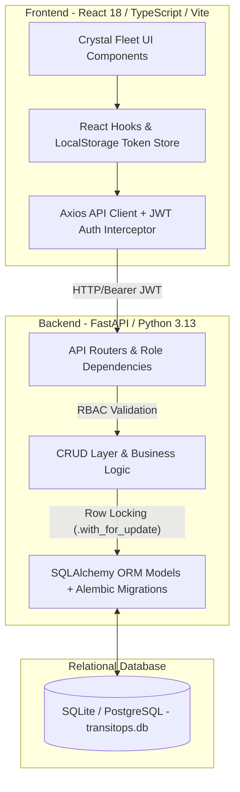
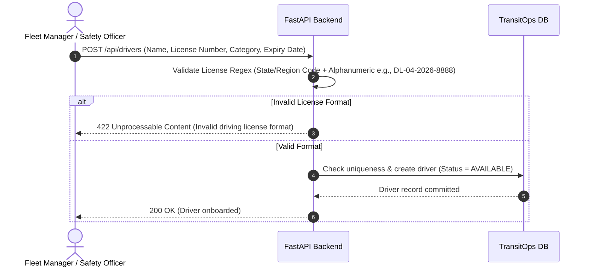
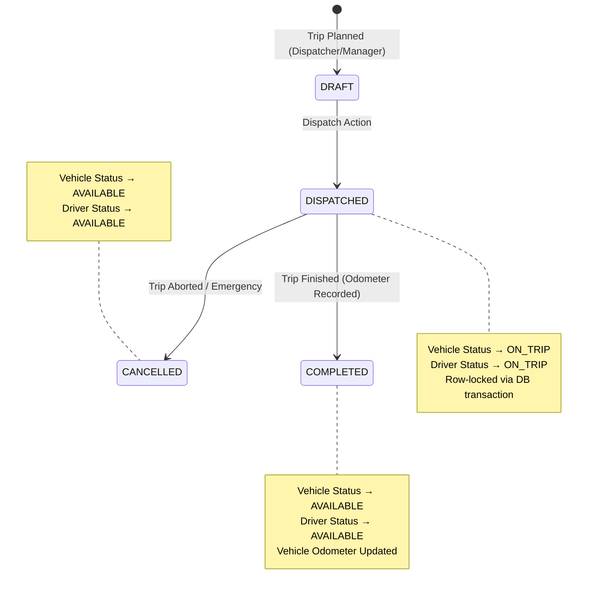
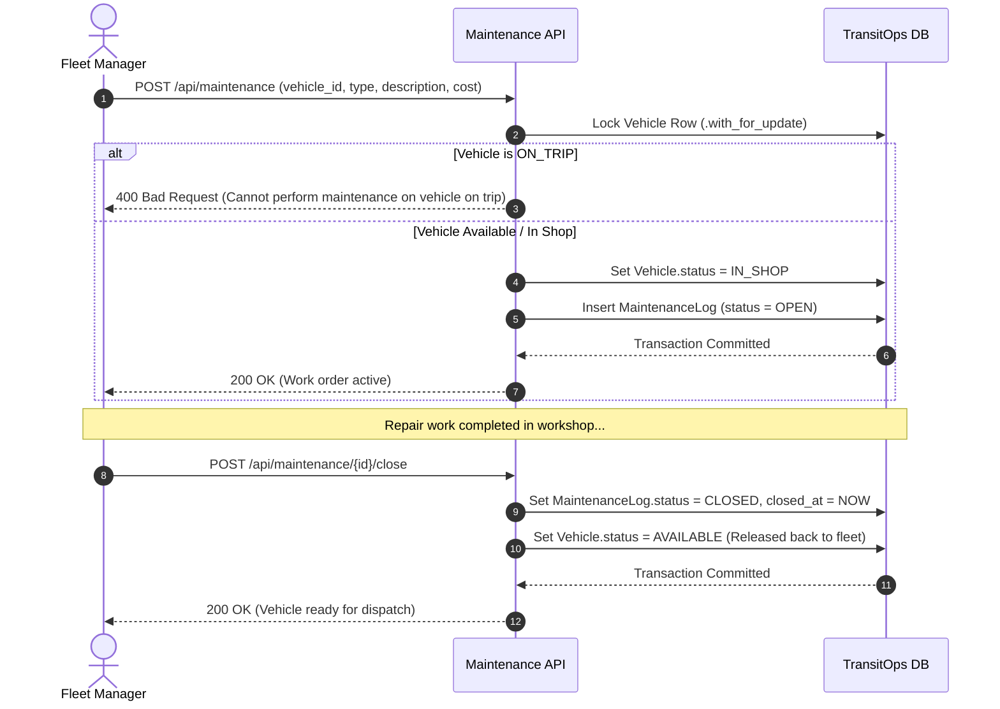

# TransitOps — Complete Project Workflow, Architecture & Operations Guide

> **Executive Summary:** TransitOps is an enterprise-grade, full-stack Fleet & Logistics Management Platform designed for real-time dispatching, rigorous safety compliance, maintenance tracking, and automated financial return-on-investment (ROI) analytics. Built with high-performance **FastAPI (Python 3.13)** and **React 18 (TypeScript + Vite)** utilizing modern **Crystal Fleet Glassmorphic Light Theme aesthetics**, the system ensures strict Role-Based Access Control (RBAC) across four operational tiers.

---

## 1. System Architecture & Tech Stack



### Technology Highlights
* **Backend Layer:** FastAPI with Pydantic v2 data validation, SQLAlchemy ORM, and Alembic database schema migrations. Uses row-level database locking (`with_for_update()`) to prevent concurrent race conditions during vehicle dispatch and shop work orders.
* **Frontend Layer:** React 18 SPA built with TypeScript and Vite. Features a custom vanilla CSS design system (`index.css`) designed around responsive light-themed glassmorphic cards, dynamic KPI indicators, and erasable input placeholders to prevent data entry friction.
* **Authentication & Security:** OAuth2 with Password Flow (Bearer JWT Tokens). Passwords undergo strict cryptographic hashing (`passlib / bcrypt`) and enforce enterprise complexity requirements.

---

## 2. Role-Based Access Control (RBAC) & Permissions Matrix

TransitOps operates under strict segregation of duties to maintain fleet safety, financial integrity, and dispatch accountability.

| Module & Operational Action | `FLEET_MANAGER` | `DISPATCHER` | `SAFETY_OFFICER` | `FINANCIAL_ANALYST` |
| :--- | :---: | :---: | :---: | :---: |
| **User Auth (Login / Profile / Signup)** | ✅ | ✅ | ✅ | ✅ |
| **View Vehicles & Fleet Status** | ✅ | ✅ | ✅ | ✅ |
| **Add New Vehicle / Retire Vehicle** | ✅ | ❌ | ❌ | ❌ |
| **View Drivers & Compliance Records** | ✅ | ✅ | ✅ | ✅ |
| **Register New Driver / Update Safety Score** | ✅ | ❌ | ✅ | ❌ |
| **Create & Dispatch Trips (`DRAFT` → `DISPATCHED`)** | ✅ | ✅ | ❌ | ❌ |
| **Complete / Cancel Active Trips** | ✅ | ✅ | ❌ | ❌ |
| **Schedule Maintenance Work Orders (`IN_SHOP`)** | ✅ | ❌ | ❌ | ❌ |
| **Complete & Release Maintenance (`CLOSED`)** | ✅ | ❌ | ❌ | ❌ |
| **Log Fuel Top-ups & Gallon Costs** | ✅ | ✅ | ❌ | ✅ |
| **Record Operating Expenses (Tolls, Stipends)** | ✅ | ✅ | ❌ | ✅ |
| **View Dashboard Analytics & Vehicle ROI** | ✅ | ✅ | ✅ | ✅ |

---

## 3. Core End-to-End Operational Workflows

### A. Vehicle & Driver Onboarding Workflow
All new fleet assets and personnel undergo automated verification before becoming active in the dispatch queue.



* **Password Enforcement:** All user signups verify `len >= 8`, containing at least one uppercase letter, one digit, and one special symbol (`@$!%*?&#^`).
* **License Standardization:** Driving licenses enforce state/region prefix matching (`^[A-Z]{2,3}[-\s/]?([A-Z0-9-\s/]){5,22}$`) to ensure regulatory compliance across jurisdictions.

---

### B. Trip Dispatch & Lifecycle Workflow (`DRAFT` → `DISPATCHED` → `COMPLETED`)
This workflow governs cargo movement, state transitions, and automatic resource locking.



* **Pre-Dispatch Compliance Check:** When a trip transitions to `DISPATCHED`, the backend locks the target `Vehicle` and `Driver` rows (`with_for_update()`).
* **Safety & Maintenance Guards:** If `Vehicle.status == IN_SHOP` or `Driver.status in [OFF_DUTY, SUSPENDED]`, the API aborts with `400 Bad Request` (`Vehicle/Driver is not available for dispatch`).
* **Odometer Sync:** Upon trip completion (`COMPLETED`), `Vehicle.odometer` is automatically incremented to match `Trip.end_odometer`, ensuring precise wear-and-tear tracking.

---

### C. Fleet Maintenance & Shop Work Order Workflow (`OPEN` → `CLOSED`)
Ensures vehicles undergoing mechanical or routine repairs cannot be illegally assigned to cargo routes.



---

### D. Financial Engine & ROI Analytical Workflow
TransitOps computes real-time profitability and cost-per-kilometer metrics across the entire fleet.

1. **Operational Cost Calculation:**
   $$\text{Total Operational Cost} = \sum (\text{Fuel Costs}) + \sum (\text{Toll Expenses}) + \sum (\text{Maintenance Costs}) + \sum (\text{Misc Stipends})$$
2. **Vehicle Return on Investment (ROI):**
   $$\text{Vehicle ROI (\%)} = \left( \frac{\text{Total Trip Revenue generated by Vehicle} - \text{Total Expenses linked to Vehicle}}{\text{Vehicle Acquisition Cost}} \right) \times 100$$
3. **Fleet Utilization Rate:**
   $$\text{Utilization (\%)} = \left( \frac{\text{Vehicles currently ON\_TRIP}}{\text{Total Active Fleet Size}} \right) \times 100$$

---

## 4. Frontend UX Philosophy & Erasable Placeholders

To eliminate user friction during high-speed dispatch and data entry, all numeric inputs and text fields across `Vehicles.tsx`, `Trips.tsx`, `FuelLogs.tsx`, `Expenses.tsx`, and `Maintenance.tsx` follow the **Erasable Placeholder Standard**:
* **No Hardcoded Defaults:** Numeric states default to `empty string` (`''` or `0` mapped cleanly to empty UI fields) rather than `0.00`.
* **Contextual Guidance Placeholders:** Every input provides clear visual examples (e.g., `placeholder="e.g. 18000"`, `placeholder="e.g. DL-01-EQ-1001"`, `placeholder="e.g. 12500"`).
* **Resilient Data Loading (`Promise.allSettled` / Catch Fallbacks):** When loading multi-entity views (such as `Maintenance.tsx`), `vehicleService.getVehicles()` and `maintenanceService.getMaintenanceLogs()` execute independently. If any single endpoint encounters a temporary delay or network issue, the accompanying dropdowns and tables still populate successfully without throwing white-screen exceptions.

---

## 5. Complete API Reference

### Auth & User Endpoints (`/api/auth`)
* `POST /api/auth/signup` — Register a new user (`FLEET_MANAGER`, `DISPATCHER`, `SAFETY_OFFICER`, `FINANCIAL_ANALYST`) with strict password complexity check.
* `POST /api/auth/login` — Obtain OAuth2 JWT access token.
* `GET /api/auth/me` — Retrieve current authenticated user profile and roles.

### Core Fleet Endpoints (`/api`)
* `GET /api/vehicles` — List all vehicles (supports `?status=AVAILABLE|IN_SHOP|ON_TRIP`).
* `POST /api/vehicles` — Create vehicle (`FLEET_MANAGER` only). Checks unique registration.
* `GET /api/drivers` — List drivers (supports status filtering).
* `POST /api/drivers` — Onboard driver (`FLEET_MANAGER`, `SAFETY_OFFICER` only). Enforces license regex.

### Trip Dispatch Endpoints (`/api/trips`)
* `GET /api/trips` — Retrieve trip log and lifecycle timestamps.
* `POST /api/trips` — Create & dispatch trip (`FLEET_MANAGER`, `DISPATCHER` only).
* `POST /api/trips/{id}/status` — Transition status (`DISPATCHED` → `COMPLETED` / `CANCELLED`). Syncs odometer.

### Maintenance Endpoints (`/api/maintenance`)
* `GET /api/maintenance` — Retrieve active shop orders and completed repair history.
* `POST /api/maintenance` — Schedule work order (`FLEET_MANAGER` only). Moves vehicle to `IN_SHOP`.
* `POST /api/maintenance/{id}/close` — Complete repair and release vehicle back to `AVAILABLE`.

### Finance & Analytics Endpoints (`/api/finance`)
* `GET /api/finance/dashboard` — Calculate comprehensive KPIs, fleet utilization, fuel efficiency, and ROI matrix.
* `POST /api/finance/fuel-logs` — Record fuel purchases (`FLEET_MANAGER`, `DISPATCHER`, `FINANCIAL_ANALYST`).
* `POST /api/finance/expenses` — Log operating tolls, repairs, or stipends.

---

## 6. Step-by-Step Local Setup & Verification Guide

### A. Backend Initialization & Seeding
1. Open PowerShell / terminal in the `backend/` directory:
   ```powershell
   cd c:\Users\"YASH BHARDWAJ"\Documents\TansitOps\backend
   ```
2. Activate Virtual Environment and initialize database tables:
   ```powershell
   .\venv\Scripts\activate
   python init_db.py
   ```
3. Run the complete seed script to generate 4 role-based demo accounts, 5 mock vehicles, 5 drivers, and active analytics:
   ```powershell
   python seed.py
   ```
   *Pre-seeded Demo Accounts (Password for all: `Admin@123$`):*
   * Fleet Manager: `admin@transitops.com`
   * Dispatcher: `dispatch@transitops.com`
   * Safety Officer: `safety@transitops.com`
   * Financial Analyst: `finance@transitops.com`

4. Run the automated 4-Role verification and RBAC compliance suite:
   ```powershell
   python test_all_4_roles.py
   ```
   *Verifies 100% of RBAC denials, status locking (`IN_SHOP` / `ON_TRIP`), password complexity (`422`), and license regex.*

5. Launch Backend Server with hot reload:
   ```powershell
   python -m uvicorn app.main:app --host 127.0.0.1 --port 8000 --reload
   ```

### B. Frontend Development Server
1. Open a second terminal in the `frontend/` directory:
   ```powershell
   cd c:\Users\"YASH BHARDWAJ"\Documents\TansitOps\frontend
   ```
2. Start the Vite development server:
   ```powershell
   npm run dev
   ```
3. Open `http://localhost:5173` in your web browser and login with any of the 4 demo roles to experience the full Crystal Fleet workflow!
